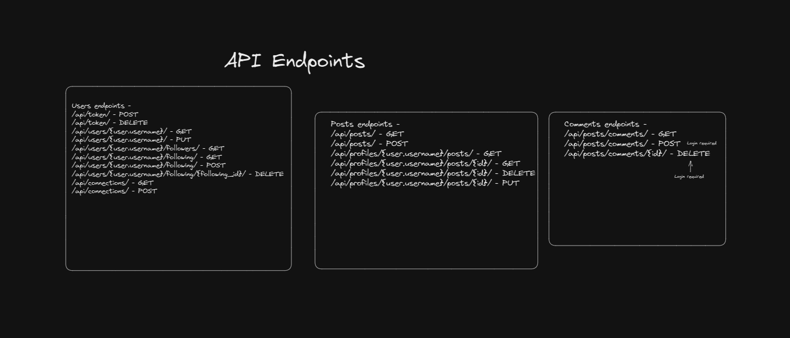
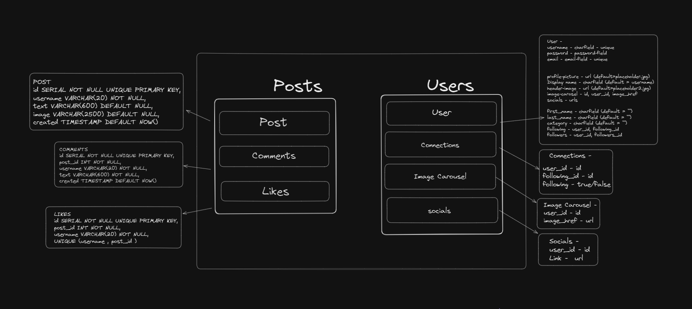
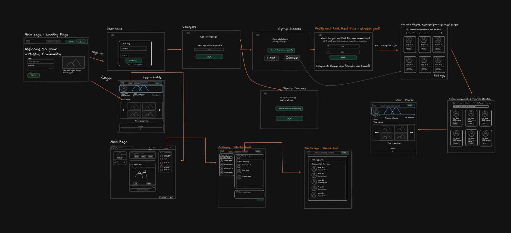

# Project Documentation

The Team:

-   Justin Brayshaw - profile portion of the User Model (profile fields, and socials, carousels, and connections)
-   Shane McCracken - sign in and sign up portion of the User Model + Auth
-   Zachary Winter - comments and likes on the back-end + mainpage frontend
-   Bryant Salazar - posts portion of the back-end + mainpage frontend

## Terminology

-   sign-in and login will be used interchangably and mean the samething
-   sign-up, and join now, create an account are all interchangable
-   Main page, the page that allows you to view all posts being made in the order created, may also be referred to as "Home Page" and are used interchangably
-   Landing page the page viewed when you hit the base url for example if we are running it locally 'localhost:3000/'which consists of a sign-in or a sign-up button
-   other's profile page, the page that gets created when you view a non-logged in users profile (profiles other than your own)
-   profile page, the page that shows the logged in users profile information you can only edit your own profile
-   profile data bread crumb pages - meaning the page that asks you for your first and last name, profile and banner picture etc etc that comes after an initial sign-up

## Design

The back-end design uses one giant database with users's and their profile being one model, a post being another model,
comments a third model, likes a fourth, and the images they place on their profile another model, and the links they wish to display on their profile a sixth model
and connections (followers) the final model.

-   API design
    
-   Data model
    
-   GHI
    

## Intended Market

We are targeting artists and graphic designers who are looking to showcase their talents in the hopes of expanding their network and finding someone who will commission their work.

## Functionality

-   visitors to the sight are greeted by a landing page where they can sign-in or sign-up
    -   if they choose to sign in they are asked for a username and password
    -   if they input a non-existant user will get a Invalid username or password error in the form
    -   upon entering a correct username and password it will wait for the token data, then navigate them to the profile page
    -   if they choose to sign-up they are asked for a username, email, and password, and to confirm their password
    -   if password doesn't match it will throw an error in console and will display a warning stating the passwords don't match
    -   if successful we navigate them to filling out some profile info in a bread crumb manner
    -   we then ask for their first and last name and upon submit takes us to the category form
    -   we then ask them what type of art they do as a text box (possibly a drop down with presets in the future) upon success we navigate them to a picture form
    -   we then ask for a link to a profile picture and header/banner picture upon succes we navigate them to their bare bones profile
-   Once logged in a user is taken to their profile page and on their profile page they can
    -   view their profile in it's current state
    -   delete any links to other social media or platforms they don't want by hovering over the link and clicking the red box
    -   delete any images in the carousel by clicking the trash can icon while on the desired image to delete|
    -   delete any posts they've made by clicking the trash can icon for the desired post to be deleted
    -   can click an edit profile button which will redirect you to to the edit profile form
        -   this form prefills your existing data, so your existing first name, last name, display name etc, excluding any social media links and images in the carousel
        -   you can then overwrite the preexisting data or leave it as is
        -   the carousel image link field and the social media link are both optional fields, you can leave them blank and it won't create a new link or image on the front page or in the database
        -   if you add a link to an image or one of your other social media profiles upon submit of the edit profile button you will be redirected back to your profile with the updated list of links and images in your carousel
-   visitors will see a dynamic navbar that changes upon login,
    -   when not logged in the Art Oasis logo in the top left navigates you to the landing page, and a sign-in and sign-up button (these two terms are subject to change, and may be Join Now or Login)
    -   when logged in the sign-in and sign-up buttons disappear and you are now greeted by a home button which takes you to the main page,
        a profile button and a logout button which each highlights based upon the currently active page, and a searchbar that allows you to search and go to another user's profile based on their display name.
    -   when someone logs out via the navbar or their token expires, it will then navigate them back to sign-in automatically and any attempt to access a page without being logged in redirects you to sign-in
    -   when someone clicks on a profile in the search menu it will take them to url /profiles/:username where :username is the username of the searched user
-   once visiting a searched for user's profile
    -   you can view the images they want to show off on their pofile
    -   you can view their social media links
    -   you can view the number of followers they have and the option to follow or unfollow them
    -   you can view a history of all their posts (currently only newest to oldest)

## Styling

for styling we used bootstrap as a base then added some custom styling to everything and I will mention who designed what below

-   profile page and other's profile page - Justin Brayshaw
-   Main Page - Zach Winter and Bryant Salazar
-   Main Page CSS break points - Justin Brayshaw
-   Navbar - Zach Winter with minor tweaks by Shane McCraken and Justin Brayshaw
-   Landing page - Shane McCracken
-   sign-up page - Shane McCracken
-   login page - Shane McCracken
-   profile data bread crumb pages - Shane McCracken

## Project Initialization

if you would like to view this project locally, please perform the following steps (docker is required)
commands come after the "Run:"

1. clone the repository to your local machine
2. in your terminal CD into the project directory
3. Run:

    ```
    docker volume create postgres-data
    ```

4. Run:

    ```
    docker compose build
    ```

5. Run:

    ```
    docker compose up
    ```

6. Since this runs on FastAPI if you are on a mac with the new Apple Silicon you need to run this command instead:
    ```
    DOCKER_DEFAULT_PLATFORM=linux/amd64 docker-compose build
    ```
7. Run:
    ```
    docker compose up
    ```
8. grab a snack and a drink because react takes a while to start up
9. go to http://localhost:3000/ and enjoy

# APIs

## Users

-   **Methods**: `POST`, `GET`, `PUT`
-   **Paths**: `/api/users`, `/api/users/<str:username>`

`POST` INPUT:

```json
{
    "email": "string",
    "profile_picture": "string",
    "display_name": "string",
    "header_image": "string",
    "first_name": "string",
    "last_name": "string",
    "password": "string",
    "username": "string",
    "category": "string",
    "about": "string"
}
```

`POST` OUTPUT:

```json
{
    "access_token": "string",
    "token_type": "Bearer",
    "user": {
        "user_id": 1,
        "email": "string",
        "profile_picture": "string",
        "display_name": "string",
        "header_image": "string",
        "first_name": "string",
        "last_name": "string",
        "username": "string",
        "category": "string",
        "about": "string"
    }
}
```

ALL OTHER OUTPUTS:

```json
{
    "user_id": 0,
    "email": "string",
    "profile_picture": "string",
    "display_name": "string",
    "header_image": "string",
    "first_name": "string",
    "last_name": "string",
    "username": "string",
    "category": "string",
    "about": "string"
}
```

creating a new user also sends a post request to `/token` which automatically logs you which returns your access token and the user's info

## Token

-   **Methods**: `GET`, `POST`, `DELETE`
-   **Paths**: `/token`

Input:

```json
{
    "username": "string",
    "password": "string"
}
```

Output:

```json
{
    "access_token": "string",
    "token_type": "Bearer"
}
```

`GET` /token Output:

```json
{
    "access_token": "string",
    "token_type": "Bearer",
    "user": {
        "user_id": 1,
        "email": "string",
        "profile_picture": "string",
        "display_name": "string",
        "header_image": "string",
        "first_name": "string",
        "last_name": "string",
        "username": "string",
        "category": "string",
        "about": "string"
    }
}
```

these methods just logs a user in and out, and get's the `token` and the userdata associated with that `token`
and gets handled automatically by jwt-down-fastapi and jwt-down-for-react

## Socials

-   **Methods**: `GET`, `PUT`, `POST`, `DELETE`
-   **Paths**: `/api/socials`, `/api/socials/<ink:id>`

Input:

```json
{
  "user_id": 0, <---- this is the user id of the person logged in and creating a link
  "link": "string"
}
```

Output:

```json
{
  "id": 0,
  "user_id": 0, <---- this is the user id of the person logged in and creating a link
  "link": "string"
}
```

this creates a link that goes on a user's profile, that can removed by hovering and clicking the red button the user_id is for the front end to filter who it belongs to

## Connections

-   **Methods**: `GET`, `PUT`, `POST`, `DELETE`
-   **Paths**: `/api/connections`, `/api/connections/<ink:id>`

Input:

```json
{
  "user_id": 0, <---- this is the user id of the person logged in and following someone
  "following_id": 0 <---- this is the user id of the person getting followed
}
```

Output:

```json
{
  "id": 0, <---- the id of the table row
  "user_id": 0, <---- this is the user id of the person logged in and following someone
  "following_id": 0 <---- this is the user id of the person getting followed
}
```

this is used for the follower count and follow button (we originally planned to create a connections page that shows a list of their followers and who they are following, but that got cut due to DB issues)

## carousels

-   **Methods**: `GET`, `PUT`, `POST`, `DELETE`
-   **Paths**: `/api/carousels`, `/api/carousels/<ink:id>`

Input:

```json
{
    "user_id": 0,
    "link": "string"
}
```

Output:

```json
{
    "id": 0,
    "user_id": 0,
    "link": "string"
}
```

this is a an image that will go inside the image carousel made in bootstrap on the front end

## posts

-   **Methods**: `GET`, `PUT`, `POST`, `DELETE`
-   **Paths**: `/api/posts`, `/api/posts/<ink:id>`

Input:

```json
{
    "username": "string",
    "text": "string",
    "image": "string"
}
```

Output:

```json
{
    "id": 0,
    "username": "string",
    "text": "string",
    "image": "string",
    "created": "2023-06-09T19:05:08.731Z"
}
```

the post automatically creates a datetime at the current time (unfortunately in UTC) and when we get all posts our queries automatically order it by created date/time
(we aren't using websockets so without a refresh we can't update the posts when another user creates a post)

## comments

-   **Methods**: `GET`, `PUT`, `POST`, `DELETE`
-   **Paths**: `/api/comments`, `/api/comments/<ink:id>`

Input:

```json
{
    "post_id": 0,
    "username": "string",
    "text": "string"
}
```

Output:

```json
{
    "id": 0,
    "post_id": 0,
    "username": "string",
    "text": "string",
    "created": "2023-06-09T19:08:26.347Z"
}
```

shows up below the post with on screen forms that automatically update when you send your comment (we aren't using websockets so without a refresh we can't update the comment section when another user creates a comment)

## likes

-   **Methods**: `GET`, `PUT`, `POST`, `DELETE`
-   **Paths**: `/api/likes`, `/api/likes/<ink:id>`

Input:

```json
{
  "post_id": 0,
  "username": "string" <---- the username of the person liking the post
}
```

Output:

```json
{
    "id": 0,
    "post_id": 0,
    "username": "string"
}
```

the front end grabs the username from the logged in user and when you click it passes that to the json body use to toggle a like button
